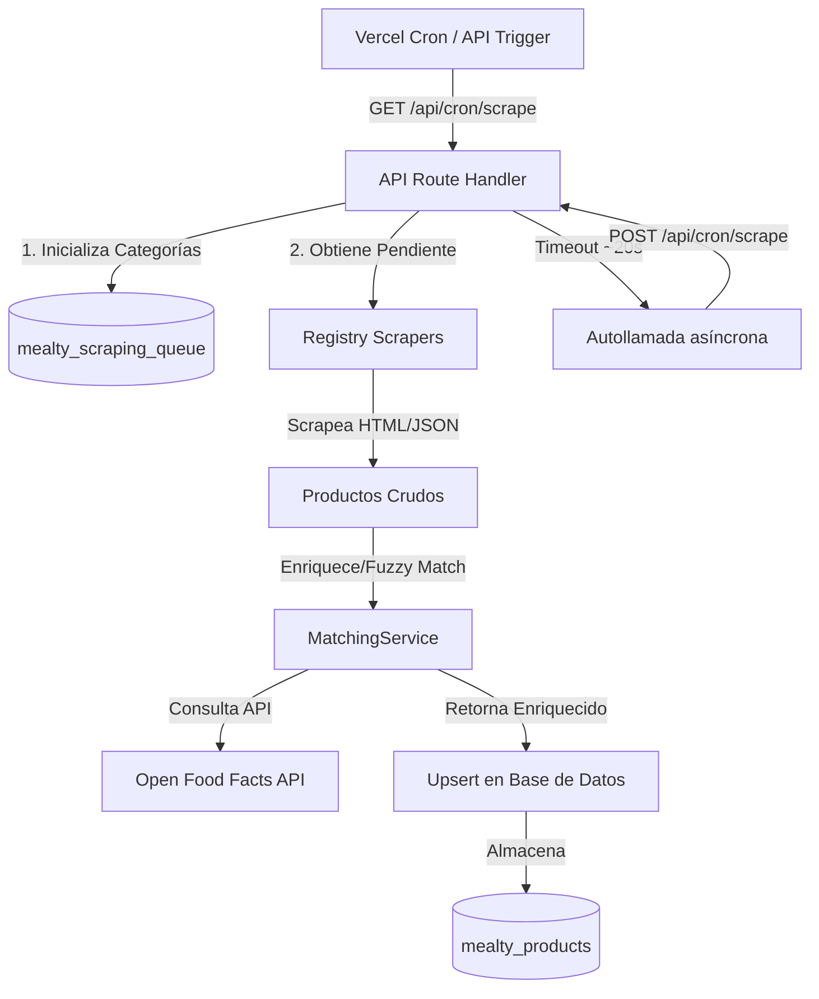

# All-Mealty Supermarket Scraper & Product Enrichment Pipeline

All-Mealty es un pipeline de extracción y enriquecimiento de datos de productos de supermercados españoles. Está diseñado para alimentar una base de datos centralizada con productos de **Carrefour, Mercadona, Dia, Aldi y Alcampo**, clasificando automáticamente qué productos son alimentos (`isFood`) y enriqueciéndolos con información nutricional detallada (calorías, grasas, proteínas, etc.), dietas compatibles (Keto, Vegana, Proteica, etc.), alérgenos y métodos de cocinado sugeridos mediante la API de **Open Food Facts**.

---

## 🚀 Características Principales

- **Multi-Scraper Automatizado**:
  - **Mercadona**: Extracción directa de su API JSON pública.
  - **Dia**: Crawling dinámico del árbol de categorías y consumo de su API JSON.
  - **Aldi**: Extracción del payload Algolia hidratado en `__NEXT_DATA__`.
  - **Alcampo**: Extracción del estado global del cliente `__INITIAL_STATE__`.
  - **Carrefour**: Extracción de selectores mediante Cheerio con soporte para proxies de ScraperAPI para evadir bloqueos de Cloudflare.
- **Cola de Ejecución Serverless (Anti-Timeout)**:
  - Sistema de procesamiento por lotes que registra categorías en base de datos.
  - Diseñado para Vercel Serverless: se detiene a los 20 segundos para evitar límites de ejecución e inicia automáticamente una llamada asíncrona "fire-and-forget" para procesar el siguiente lote de forma encadenada.
- **Motor Inteligente de Coincidencia (MatchingService)**:
  - **Deduplicación automática**: Corrige textos repetidos procedentes del DOM.
  - **Normalización de acentos**: Elimina tildes y diacríticos antes de comparar cadenas para maximizar el acierto (e.g., `plátano` ➔ `platano`).
  - **Eliminación de descriptores**: Quita marcas, formatos, pesos y descriptores superfluos (como `hacendado`, `carrefour`, `1 kg`, `pack 6`, `bio`, `ecologico`) para aislar la identidad real del producto.
  - **Búsqueda progresiva con stop words**: Reduce el nombre del producto palabra por palabra en Open Food Facts hasta encontrarlo, deteniéndose antes de buscar palabras vacías genéricas (como `de`, `y`, `con`, `del`).
  - **Sinónimos**: Mapeo inteligente de términos comerciales a biológicos (e.g., `banana` ➔ `platano`).
  - **Fuzzy Matching**: Algoritmo de similitud de Sørensen-Dice con umbral de seguridad de coincidencia del 80%.
- **Clasificador Avanzado**:
  - **Filtro de No-Alimentos (Cosmética, Perfumería, Higiene)**: Descarta automáticamente geles, champús, cremas, maquillaje y productos de limpieza basándose en palabras clave normalizadas (e.g., *Eau de parfum*, *laca de uñas*, *toallitas*).
  - **Categorización de Dietas**: Identifica alimentos altos en proteína, bajos en calorías, saludables (Nutri-Score A/B), aptos para dieta Keto y Veganos.
  - **Detección de Alérgenos**: Clasifica alérgenos críticos (Gluten, Lactosa, Huevo, Pescado, Soja, Frutos secos, Mariscos).
  - **Métodos de Cocinado sugeridos**: Recomienda sartén, horno, microondas o freidora de aire según las palabras en el nombre.

---

## 🛠️ Arquitectura del Sistema



---

## 🗄️ Esquema de Base de Datos (Prisma)

El sistema utiliza PostgreSQL. Los modelos clave en [schema.prisma](file:///c:/Users/asdiqa/dev/giralabs/all-mealty/prisma/schema.prisma) son:

### 1. `Product` (`mealty_products`)
Almacena la información final de cada producto procesado.
- `id` (UUID): Identificador único.
- `name` (String): Nombre limpio y formateado del producto.
- `price` (Decimal): Precio actual.
- `imageUrl` (String): URL de la imagen del producto.
- `supermarket` (Enum): `mercadona`, `aldi`, `dia`, `carrefour`, `alcampo`.
- `isFood` (Boolean): Indica si es comestible.
- `dietTypes` (String[]): Dietas compatibles (e.g. `['vegan', 'healthy']`).
- `allergens` (String[]): Alérgenos presentes o `['none']`.
- `cookingMethods` (String[]): Métodos sugeridos (e.g. `['sarten', 'air_frayer']`).
- `nutritionalInfo` (Json): Información nutricional por 100g en formato:
  ```json
  {
    "calories": 261,
    "proteins": 8.4,
    "fats": 1.0,
    "carbohydrates": 54.0,
    "salt": 1.28,
    "fiber": 2.0
  }
  ```
- `lastUpdated` (DateTime): Última actualización.

### 2. `ScrapingQueue` (`mealty_scraping_queue`)
Cola de procesamiento que gestiona el estado de las categorías.
- `id` (UUID).
- `supermarket` (Enum).
- `categoryUrl` (String).
- `categoryName` (String).
- `status` (Enum): `pending`, `processing`, `completed`, `failed`.
- `lastAttempt` (DateTime).
- `error` (String).

---

## ⚙️ Configuración y Requisitos

Crea un archivo `.env` en la raíz del proyecto con las siguientes variables:

```bash
# Conexión a la base de datos (Supabase)
DATABASE_URL="postgresql://[USER]:[PASSWORD]@[HOST]:6543/postgres?pgbouncer=true&statement_cache_size=0"
DIRECT_URL="postgresql://[USER]:[PASSWORD]@[HOST]:5432/postgres"

# Secreto para autorizar los cron jobs
CRON_SECRET="tu-uuid-o-clave-secreta"

# Opcional: Proxy de ScraperAPI para el scraper de Carrefour (evita bloqueos de Cloudflare)
SCRAPING_API_KEY="tu-api-key-de-scraperapi"
```

### Instalación:
```bash
# Instalar dependencias
npm install

# Generar cliente de Prisma
npx prisma generate
```

---

## ⚙️ Ejecución y Pruebas

### 1. Iniciar Servidor Local
```bash
npm run dev
```

### 2. Ejecutar Scraper de forma manual
Puedes simular el cronjob ejecutando una petición HTTP. Requiere la cabecera `Authorization: Bearer <CRON_SECRET>`:

- **Ejecutar todos los supermercados**:
  `GET http://localhost:3000/api/cron/scrape`
- **Ejecutar un supermercado específico** (recomendado para aislamiento):
  `GET http://localhost:3000/api/cron/scrape?supermarket=carrefour`
  `GET http://localhost:3000/api/cron/scrape?supermarket=mercadona`

---

## 🧹 Mantenimiento de Base de Datos

En la carpeta [scripts/](file:///c:/Users/asdiqa/dev/giralabs/all-mealty/scripts/) se incluye la herramienta de mantenimiento:

### `cleanup-products.js`
Este script realiza tareas de limpieza directamente sobre los productos que ya están en base de datos.
- Deduplica nombres que contengan retornos de carro de selectores antiguos.
- Identifica falsos positivos de comida (e.g. perfumes, desodorantes, cremas) mediante el algoritmo mejorado de no-alimentos y los marca como `isFood: false`.
- Intenta re-enriquecer productos comestibles que no tengan valores nutricionales debido a fallos previos de Open Food Facts o a cadenas duplicadas que impedían la coincidencia.

**Ejecución:**
```bash
node scripts/cleanup-products.js
```
